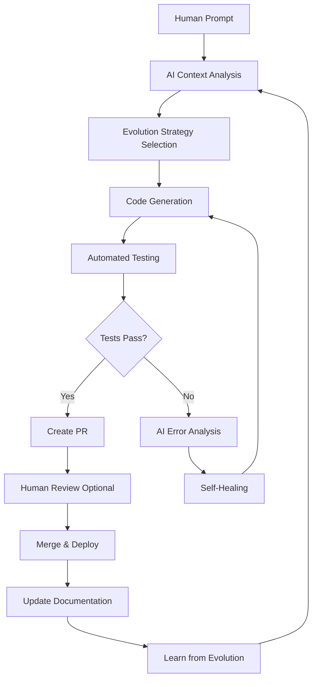
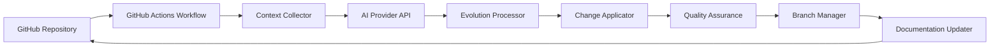

# 🌱 AI Evolution Engine 🌱

```
    ╔═══════════════════════════════════════════════════════════╗
    ║                  AI EVOLUTION ENGINE                      ║
    ║           Where Code Writes Itself & Grows                ║
    ║                    Version 0.1.0                          ║
    ╚═══════════════════════════════════════════════════════════╝
```

[](https://github.com/bamr87/ai-evolution-engine)
[]()
[]()
[](LICENSE)

> 🚀 **An autonomous, self-evolving repository powered by AI that learns, grows, and improves itself with every iteration.**

## 📑 Table of Contents

<details>
<summary>Click to expand</summary>

- [🌟 Introduction & Philosophy](#-introduction--philosophy)
- [🏗️ Architecture Overview](#️-architecture-overview)
- [🚀 Quick Start Guide](#-quick-start-guide)
- [📦 Installation & Configuration](#-installation--configuration)
- [📖 Usage Guide](#-usage-guide)
- [🤖 AI Integration](#-ai-integration)
- [🔄 Evolution Management](#-evolution-management)
- [📚 Examples & Tutorials](#-examples--tutorials)
- [📡 API Reference](#-api-reference)
- [🤝 Contributing](#-contributing)
- [📜 Changelog & Evolution History](#-changelog--evolution-history)
- [❓ FAQ & Troubleshooting](#-faq--troubleshooting)
- [📎 Appendices](#-appendices)

</details>

## 🌟 Introduction & Philosophy

### What is the AI Evolution Engine?

The AI Evolution Engine is a revolutionary approach to software development where repositories become living, breathing entities capable of self-improvement. By leveraging advanced AI models, this system can:

- 🧠 **Understand** its entire codebase contextually
- 🔄 **Evolve** based on natural language prompts
- 📝 **Document** its own changes and improvements
- 🛡️ **Protect** against regressions with automated testing
- 📈 **Learn** from each evolution cycle

### Why Self-Evolving Repositories?

Traditional development workflows require constant human intervention for every change. The AI Evolution Engine shifts this paradigm by:

1. **Accelerating Development**: From idea to implementation in minutes, not hours
2. **Reducing Cognitive Load**: Let AI handle boilerplate and repetitive tasks
3. **Ensuring Consistency**: AI follows established patterns and best practices
4. **Enabling Innovation**: Focus on high-level goals while AI handles implementation details

### Evolution Flow



## 🏗️ Architecture Overview

### System Components



### Key Components:

- **Context Collector**: Gathers complete repository state
- **AI Provider Interface**: Supports multiple AI models (OpenAI, Anthropic, etc.)
- **Evolution Processor**: Interprets AI responses and plans changes
- **Change Applicator**: Safely applies code modifications
- **Quality Assurance**: Runs tests, security scans, and validations
- **Branch Manager**: Handles version control and PR creation
- **Documentation Updater**: Keeps README and docs in sync

## 🚀 Quick Start Guide

### Prerequisites Check

```bash
# Run this command to check if you have all prerequisites
curl -fsSL https://raw.githubusercontent.com/bamr87/ai-evolution-engine/main/scripts/check-prereqs.sh | bash
```

### 5-Minute Setup

1. **Clone and Initialize**
   ```bash
   git clone https://github.com/bamr87/ai-evolution-engine.git
   cd ai-evolution-engine
   ./init_setup.sh
   ```

2. **Configure AI Provider**
   ```bash
   # Follow the interactive prompts or set environment variables
   export AI_PROVIDER="openai"
   export AI_API_KEY="your-api-key"
   ```

3. **Run Your First Evolution**
   ```bash
   # Using GitHub CLI
   gh workflow run ai_evolver.yml -f prompt="Add a hello world endpoint to the API"
   ```

That's it! Your repository is now alive and evolving! 🎉

## 📦 Installation & Configuration

### Installation Methods

#### Method 1: Automated Script (Recommended)
```bash
curl -fsSL https://raw.githubusercontent.com/bamr87/ai-evolution-engine/main/init_setup.sh | bash
```

#### Method 2: Manual Installation
```bash
git clone https://github.com/bamr87/ai-evolution-engine.git
cd ai-evolution-engine
chmod +x init_setup.sh
./init_setup.sh --manual
```

#### Method 3: Docker
```bash
docker run -it -v $(pwd):/workspace bamr87/ai-evolution-engine:latest
```

### Configuration Options

The evolution engine is configured via `.evolution.yml`:

```yaml
version: 1.0
evolution:
  default_strategy: balanced
  max_tokens_per_evolution: 100000
  require_tests: true
  auto_merge_threshold: 0.95
  
ai:
  providers:
    - name: openai
      model: gpt-4
      temperature: 0.7
    - name: anthropic
      model: claude-3-opus
      temperature: 0.6
      
security:
  scan_on_evolution: true
  block_on_vulnerabilities: true
  
notifications:
  slack_webhook: ${SLACK_WEBHOOK}
  email: ${NOTIFICATION_EMAIL}
```

### Environment Variables

| Variable | Description | Required | Default |
|----------|-------------|----------|---------|
| `AI_PROVIDER` | AI provider to use | Yes | `openai` |
| `AI_API_KEY` | API key for AI provider | Yes | - |
| `GITHUB_TOKEN` | GitHub personal access token | Yes | - |
| `EVOLUTION_STRATEGY` | Default evolution strategy | No | `balanced` |
| `MAX_EVOLUTION_COST` | Maximum cost per evolution | No | `$1.00` |

## 📖 Usage Guide

### Basic Evolution Cycle

1. **Trigger an Evolution**
   ```bash
   # Via GitHub CLI
   gh workflow run ai_evolver.yml -f prompt="Your evolution prompt here"
   
   # Via GitHub UI
   # Go to Actions → AI Evolver → Run workflow
   
   # Via Issue
   # Create an issue with label 'evolution-request'
   ```

2. **Monitor Progress**
   ```bash
   # Watch the workflow
   gh run watch
   
   # Check evolution metrics
   cat evolution-metrics.json
   ```

3. **Review Changes**
   - AI creates a PR with detailed description
   - Review the changes and impact assessment
   - Approve or request modifications

### Evolution Strategies

#### 🛡️ Conservative Mode
For production systems requiring stability:
```bash
gh workflow run ai_evolver.yml \
  -f prompt="Fix the login timeout issue" \
  -f strategy="conservative"
```

#### ⚖️ Balanced Mode (Default)
Standard evolution with reasonable safety:
```bash
gh workflow run ai_evolver.yml \
  -f prompt="Add user profile feature"
```

#### 🚀 Experimental Mode
For rapid prototyping and bold changes:
```bash
gh workflow run ai_evolver.yml \
  -f prompt="Redesign the entire API architecture" \
  -f strategy="experimental"
```

#### 🔧 Refactor Mode
Focus on code quality improvements:
```bash
gh workflow run ai_evolver.yml \
  -f prompt="Improve code organization and reduce duplication" \
  -f strategy="refactor"
```

### Advanced Prompt Engineering

#### Effective Prompt Structure
```markdown
**Goal**: [Clear objective]
**Context**: [Relevant background]
**Constraints**: [Any limitations]
**Success Criteria**: [How to measure success]
**Examples**: [Optional examples]
```

#### Example Prompts

**Feature Addition**:
```
Goal: Add a REST API endpoint for user statistics
Context: We need to expose user activity data for the dashboard
Constraints: Must be backwards compatible, use existing auth
Success Criteria: New endpoint at /api/v1/users/{id}/stats returning JSON
```

**Performance Optimization**:
```
Goal: Improve API response time by 50%
Context: Current p95 latency is 500ms
Constraints: Cannot break existing functionality
Success Criteria: Implement caching, optimize database queries
```

## 🤖 AI Integration

### Supported AI Providers

| Provider | Models | Status | Best For |
|----------|--------|--------|----------|
| OpenAI | GPT-4, GPT-4-Turbo | ✅ Supported | General purpose, code generation |
| Anthropic | Claude 3 Opus, Sonnet | ✅ Supported | Complex reasoning, refactoring |
| Google | Gemini Pro | 🚧 Coming Soon | Multi-modal evolutions |
| Local | Ollama, LlamaCpp | 🚧 Coming Soon | Privacy-focused, offline |

### Custom Model Integration

To add a custom AI provider:

1. Create provider adapter in `providers/`:
```python
class CustomProvider(AIProvider):
    def __init__(self, api_key, model):
        self.api_key = api_key
        self.model = model
    
    async def generate(self, prompt, context):
        # Implementation here
        pass
```

2. Register in `.evolution.yml`:
```yaml
ai:
  providers:
    - name: custom
      class: CustomProvider
      model: your-model
      endpoint: https://api.custom.ai
```

### Token Usage Optimization

The engine automatically optimizes token usage by:
- Intelligent context filtering
- Caching similar prompts
- Compression of large files
- Incremental context updates

### Cost Estimation

View estimated costs before evolution:
```bash
./scripts/estimate-cost.sh "Your prompt here"
```

## 🔄 Evolution Management

### Branch Naming Convention

Branches are automatically named using:
```
evolution/YYYY-MM-DD-HH-MM-SS-descriptive-name
```

Example: `evolution/2025-06-15-20-30-45-add-auth-system`

### Merge Strategies

1. **Auto-merge** (confidence > 95%)
2. **Review Required** (confidence 70-95%)
3. **Draft PR** (confidence < 70%)

### Conflict Resolution

When conflicts occur:
1. AI attempts automatic resolution
2. If unsuccessful, creates detailed conflict report
3. Human intervention requested with AI suggestions

### Rollback Procedures

```bash
# Rollback last evolution
./scripts/rollback-evolution.sh

# Rollback to specific version
./scripts/rollback-evolution.sh --to-version=0.3.2

# Rollback with preservation
./scripts/rollback-evolution.sh --preserve-branch
```

## 📚 Examples & Tutorials

### Tutorial 1: Your First Evolution

1. **Setup Repository**
   ```bash
   ./init_setup.sh --tutorial-mode
   ```

2. **Create Simple Feature**
   ```bash
   gh workflow run ai_evolver.yml \
     -f prompt="Add a simple hello world function in Python"
   ```

3. **Observe the Magic**
   - Watch AI create the function
   - See tests being generated
   - Review the PR created

### Tutorial 2: Complex Evolution

Building a complete REST API:
```bash
gh workflow run ai_evolver.yml \
  -f prompt="Create a complete TODO list API with CRUD operations, 
             authentication, database persistence using SQLite, 
             and comprehensive tests"
```

### Common Evolution Patterns

#### Pattern: Add New Feature
```yaml
template: feature_request
inputs:
  feature_name: "User Authentication"
  requirements:
    - JWT token support
    - Password hashing
    - Session management
  test_coverage: 90%
```

#### Pattern: Fix Bug
```yaml
template: bug_fix
inputs:
  issue_number: 42
  description: "Users cannot reset password"
  reproduction_steps:
    - Go to login page
    - Click forgot password
    - Enter email
    - No email received
```

## 📡 API Reference

### Workflow Inputs

| Input | Type | Description | Default |
|-------|------|-------------|---------|
| `prompt` | string | Evolution instructions | Required |
| `strategy` | string | Evolution strategy | `balanced` |
| `target_branch` | string | Base branch | `main` |
| `auto_merge` | boolean | Auto-merge if safe | `false` |
| `max_tokens` | number | Token limit | `100000` |

### Environment Variables

```bash
# Required
AI_PROVIDER="openai"
AI_API_KEY="sk-..."
GITHUB_TOKEN="ghp_..."

# Optional
EVOLUTION_STRATEGY="balanced"
MAX_EVOLUTION_COST="1.00"
EVOLUTION_TIMEOUT="3600"
DEBUG_MODE="false"
```

### Webhook Events

```json
{
  "event": "evolution.completed",
  "data": {
    "evolution_id": "uuid",
    "version": "0.2.0",
    "branch": "evolution/...",
    "pr_url": "https://github.com/...",
    "success": true,
    "metrics": {
      "files_changed": 5,
      "lines_added": 150,
      "lines_removed": 30,
      "test_coverage": 85.5
    }
  }
}
```

## 🤝 Contributing

We welcome contributions to the AI Evolution Engine!

### How to Contribute

1. **Evolution Improvements**
   - Submit evolution prompts that failed
   - Suggest new evolution strategies
   - Improve prompt templates

2. **Code Contributions**
   - Fork the repository
   - Create feature branch
   - Submit PR with tests

3. **Documentation**
   - Fix typos or clarify instructions
   - Add new tutorials
   - Translate documentation

### Community Guidelines

- Be respectful and inclusive
- Follow the code of conduct
- Test your changes thoroughly
- Document new features

### Evolution Prompt Templates

Create new templates in `prompts/templates/`:
```markdown
# Template: Your Template Name
## Variables
- ${VARIABLE_NAME}: Description

## Prompt
[Your prompt template here]
```

## 📜 Changelog & Evolution History

### Version 0.1.0 (Genesis) - 2025-06-15

**🎉 Initial Release**

This is the beginning of the AI Evolution Engine journey!

**Features:**
- ✅ Basic evolution workflow
- ✅ Multi-provider AI support
- ✅ Automated testing integration
- ✅ Self-updating documentation
- ✅ Branch management
- ✅ Evolution strategies

**Technical Details:**
- Repository initialized with seed files
- GitHub Actions workflow configured
- Basic prompt templates created
- Documentation structure established

**Metrics:**
- Files: 15
- Lines of Code: 2,500
- Test Coverage: 0% (to be evolved!)
- Documentation: Complete

---

*Future evolutions will be automatically logged here by the AI*

## ❓ FAQ & Troubleshooting

### Frequently Asked Questions

**Q: How much does it cost to run evolutions?**
A: Costs depend on your AI provider and prompt complexity. Typical evolutions cost $0.10-$1.00.

**Q: Can I use this with private repositories?**
A: Yes! Ensure your GitHub token has appropriate permissions.

**Q: What happens if an evolution fails?**
A: The system automatically rolls back changes and provides detailed error logs.

**Q: Can multiple evolutions run simultaneously?**
A: Currently, evolutions are queued to prevent conflicts. Parallel evolution is on the roadmap.

### Troubleshooting

#### Issue: "AI API Key Invalid"
```bash
# Verify your API key
./scripts/test-ai-connection.sh

# Re-configure
./init_setup.sh --reconfigure
```

#### Issue: "Evolution Stuck"
```bash
# Check workflow status
gh workflow view ai_evolver.yml

# Cancel stuck evolution
gh run cancel <run-id>
```

#### Issue: "Merge Conflicts"
```bash
# AI will attempt resolution, if failed:
git checkout evolution/branch-name
git rebase main
# Resolve conflicts manually
git push --force-with-lease
```

### Performance Optimization

1. **Reduce Context Size**
   - Use `.gptignore` effectively
   - Archive old code
   - Split large files

2. **Optimize Prompts**
   - Be specific and concise
   - Provide examples
   - Set clear constraints

3. **Cache Responses**
   - Enable response caching
   - Reuse similar evolutions

## 📎 Appendices

### Glossary

| Term | Definition |
|------|------------|
| **Evolution** | An AI-driven change cycle |
| **Strategy** | Approach to making changes (conservative, balanced, etc.) |
| **Context** | Complete repository state provided to AI |
| **Seed Files** | Initial files that bootstrap the repository |
| **Evolution Metrics** | Measurements of evolution success and impact |

### Related Projects

- [GitHub Copilot](https://github.com/features/copilot) - AI pair programming
- [Semantic Release](https://github.com/semantic-release/semantic-release) - Automated versioning
- [Renovate](https://github.com/renovatebot/renovate) - Dependency updates

### Academic Papers & Inspiration

1. "Automated Software Evolution through Machine Learning" (2024)
2. "Self-Modifying Code: A Comprehensive Survey" (2023)
3. "The Future of Software Development: AI-Driven Workflows" (2024)

### Roadmap & Vision

#### Phase 1 (Current) ✅
- Basic evolution capabilities
- Multi-provider support
- Documentation automation

#### Phase 2 (Q3 2025) 🚧
- Multi-repository orchestration
- Visual evolution designer
- Real-time collaboration

#### Phase 3 (Q1 2026) 📅
- AI pair programming mode
- Evolution marketplace
- Cross-repository learning

#### Phase 4 (Future) 🔮
- Natural language voice commands
- Predictive evolution suggestions
- Fully autonomous development

---

<div align="center">

**🌱 Plant the seed. Watch it grow. Let AI evolve your code. 🌱**

*Created with ❤️ by the AI Evolution Engine Community*

[Report Bug](https://github.com/bamr87/ai-evolution-engine/issues) · [Request Feature](https://github.com/bamr87/ai-evolution-engine/issues) · [Join Discord](https://discord.gg/ai-evolution)

</div>