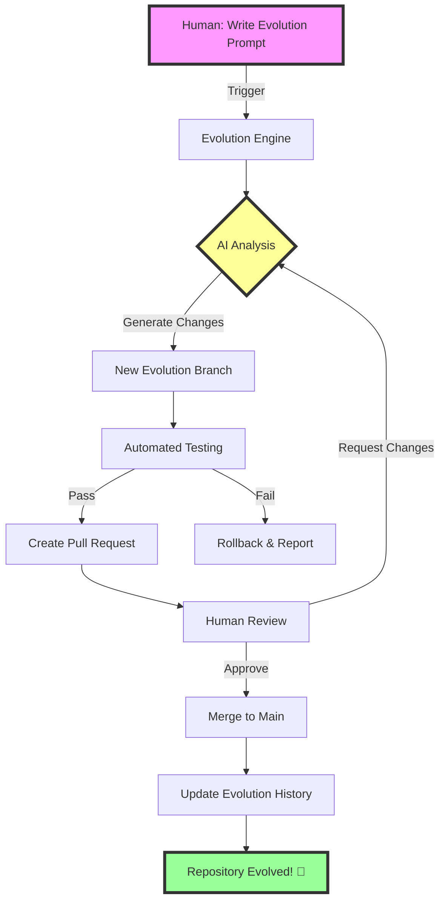
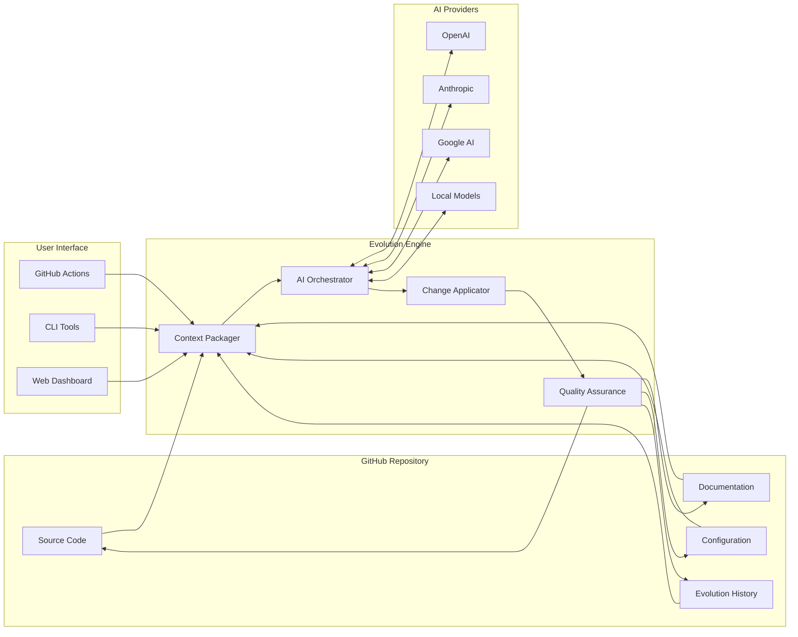
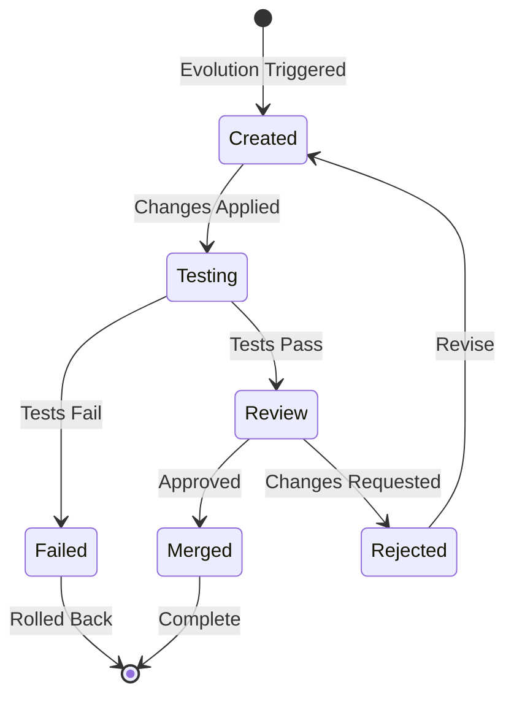

# 🧬 AI Evolution Engine 🧬
### *Where Code Writes Itself, and Repositories Come Alive*

<div align="center">

[](https://github.com/bamr87/ai-evolution-engine)
[](LICENSE)
[]()
[]()
[]()

**Transform your GitHub repository into a living, breathing, self-evolving ecosystem powered by AI**

[Quick Start](#-quick-start-guide) • [Documentation](#-detailed-documentation) • [Examples](#-examples--tutorials) • [Contributing](#-contributing)

</div>

---

## 📑 Table of Contents

<details>
<summary>Click to expand</summary>

- [🎯 Introduction & Philosophy](#-introduction--philosophy)
- [🏗️ Architecture Overview](#️-architecture-overview)
- [🚀 Quick Start Guide](#-quick-start-guide)
- [📚 Detailed Documentation](#-detailed-documentation)
  - [Installation & Configuration](#installation--configuration)
  - [Usage Guide](#usage-guide)
  - [AI Integration](#ai-integration)
  - [Evolution Management](#evolution-management)
- [📖 Examples & Tutorials](#-examples--tutorials)
- [🔌 API Reference](#-api-reference)
- [🤝 Contributing](#-contributing)
- [📜 Evolution History](#-evolution-history)
- [❓ FAQ & Troubleshooting](#-faq--troubleshooting)
- [📎 Appendices](#-appendices)

</details>

---

## 🎯 Introduction & Philosophy

### What is a Self-Evolving Repository?

Imagine a repository that doesn't just store your code—it actively improves it. The AI Evolution Engine transforms traditional development by enabling repositories to:

- 🧠 **Understand** their own codebase and purpose
- 🔄 **Evolve** based on natural language instructions
- 📈 **Improve** code quality, documentation, and structure autonomously
- 🛡️ **Maintain** stability through intelligent branching and testing

### The Evolution Flow



### Why Self-Evolving Repositories?

Traditional development faces several challenges:
- **Context Loss**: Developers spend 70% of time understanding existing code
- **Documentation Drift**: Docs become outdated as code evolves
- **Repetitive Tasks**: Many changes follow predictable patterns
- **Knowledge Silos**: Team knowledge isn't captured in the code

The AI Evolution Engine solves these by making the repository itself intelligent and self-aware.

---

## 🏗️ Architecture Overview

### System Components



### Security Architecture

- 🔐 **Encrypted Secrets**: All API keys stored as GitHub secrets
- 🛡️ **Token Scoping**: Minimal permissions for each operation
- 🔍 **Audit Logging**: Complete trail of all evolutions
- 🚨 **Anomaly Detection**: AI monitors for unusual changes

---

## 🚀 Quick Start Guide

### 5-Minute Setup

```bash
# 1. Clone this repository
git clone https://github.com/bamr87/ai-evolution-engine.git
cd ai-evolution-engine

# 2. Run the setup script
chmod +x init_setup.sh
./init_setup.sh --quick

# 3. Create your first evolution prompt
echo "Add a simple REST API with user endpoints" > prompts/first_evolution.md

# 4. Commit and push
git add .
git commit -m "🚀 Initialize AI Evolution Engine"
git push origin main

# 5. Trigger your first evolution!
# Go to GitHub Actions and run the "🤖 Autonomous Repository Evolution Engine" workflow
```

### Prerequisites Checker

Run this command to verify your environment:

```bash
curl -sSL https://raw.githubusercontent.com/bamr87/ai-evolution-engine/main/scripts/check_prerequisites.sh | bash
```

---

## 📚 Detailed Documentation

### Installation & Configuration

#### Method 1: Interactive Setup (Recommended)

```bash
./init_setup.sh
```

This will guide you through:
- GitHub authentication setup
- AI provider configuration
- Repository customization
- Initial evolution strategy selection

#### Method 2: Automated Setup

```bash
export GITHUB_TOKEN="your-pat-token"
export AI_API_KEY="your-ai-key"
export AI_PROVIDER="openai"  # or anthropic, google, local

./init_setup.sh --silent
```

#### Method 3: Docker Setup

```bash
docker run -it \
  -e GITHUB_TOKEN="$GITHUB_TOKEN" \
  -e AI_API_KEY="$AI_API_KEY" \
  -v $(pwd):/workspace \
  ghcr.io/bamr87/ai-evolution-engine:latest
```

#### Configuration Options

Edit `.evolution.yml` to customize behavior:

```yaml
version: 1.0
evolution:
  default_strategy: balanced      # conservative | balanced | experimental
  max_tokens_per_evolution: 100000
  require_tests: true
  auto_merge_threshold: 0.95      # 0-1, confidence level for auto-merge
  
ai:
  primary_provider: openai
  fallback_provider: anthropic
  providers:
    - name: openai
      model: gpt-4-turbo-preview
      temperature: 0.7
      max_retries: 3
    - name: anthropic
      model: claude-3-opus-20240229
      temperature: 0.6
      max_retries: 2
      
quality:
  min_test_coverage: 80
  require_documentation: true
  code_style: automatic          # strict | automatic | preserve
  
monitoring:
  track_costs: true
  alert_threshold: 10.00         # USD
  metrics_dashboard: enabled
```

### Usage Guide

#### Basic Evolution Cycle

1. **Create an Evolution Prompt**

```markdown
# prompts/add_user_auth.md

## Goal: Add User Authentication

**Requirements:**
- JWT-based authentication
- User registration and login endpoints
- Password hashing with bcrypt
- Rate limiting on auth endpoints

**Constraints:**
- Use existing database schema
- Maintain backward compatibility
- Include comprehensive tests
```

2. **Trigger Evolution**

```bash
# Via GitHub UI
# Actions → AI Evolution Engine → Run Workflow

# Via GitHub CLI
gh workflow run ai_evolver.yml -f prompt_file_path=prompts/add_user_auth.md

# Via API
curl -X POST \
  -H "Authorization: token $GITHUB_TOKEN" \
  -H "Accept: application/vnd.github.v3+json" \
  https://api.github.com/repos/bamr87/ai-evolution-engine/dispatches \
  -d '{"event_type":"evolution","client_payload":{"prompt_file":"prompts/add_user_auth.md"}}'
```

#### Evolution Strategies

Choose the right strategy for your needs:

| Strategy | Description | Use Case | Risk Level |
|----------|-------------|----------|------------|
| **Conservative** | Minimal, safe changes only | Production systems | Low |
| **Balanced** | Standard evolution mode | Most projects | Medium |
| **Experimental** | Allow breaking changes | Early development | High |
| **Refactor** | Focus on code quality | Technical debt | Low |
| **Performance** | Optimize for speed | Bottleneck fixing | Medium |
| **Security** | Fix vulnerabilities | Security audits | Low |

#### Advanced Prompt Engineering

**Effective Prompt Structure:**

```markdown
## Context
[Current state and problem description]

## Goal
[Clear, measurable objective]

## Requirements
- [Specific requirement 1]
- [Specific requirement 2]

## Constraints
- [Limitation or boundary 1]
- [Limitation or boundary 2]

## Success Criteria
- [ ] Criterion 1
- [ ] Criterion 2

## Examples
[Optional: Provide examples of desired outcome]
```

### AI Integration

#### Supported Providers

| Provider | Models | Best For | Setup Guide |
|----------|--------|-----------|-------------|
| OpenAI | GPT-4, GPT-3.5 | General purpose | [Guide](docs/providers/openai.md) |
| Anthropic | Claude 3 Opus/Sonnet | Complex reasoning | [Guide](docs/providers/anthropic.md) |
| Google | Gemini Pro/Ultra | Multimodal tasks | [Guide](docs/providers/google.md) |
| Local | Llama, Mistral | Privacy, cost | [Guide](docs/providers/local.md) |

#### Custom Model Integration

```python
# models/custom_provider.py
from evolution_engine import BaseAIProvider

class CustomProvider(BaseAIProvider):
    def __init__(self, api_key: str, endpoint: str):
        self.api_key = api_key
        self.endpoint = endpoint
    
    async def generate_evolution(self, context: dict) -> dict:
        # Your implementation here
        pass
```

#### Token Optimization

The system automatically optimizes token usage:

- **Smart Context Selection**: Only relevant files included
- **Incremental Updates**: Send diffs for large files
- **Caching**: Reuse contexts for similar prompts
- **Compression**: Automatic content compression

### Evolution Management

#### Branch Lifecycle



#### Merge Strategies

1. **Auto-Merge** (confidence > threshold)
   ```yaml
   evolution:
     auto_merge_threshold: 0.95
     require_approvals: 0
   ```

2. **Protected Merge** (requires review)
   ```yaml
   evolution:
     auto_merge_threshold: 1.1  # Effectively disabled
     require_approvals: 2
   ```

3. **Staged Merge** (progressive rollout)
   ```yaml
   evolution:
     merge_strategy: staged
     stages:
       - develop: immediate
       - staging: after_1_day
       - main: after_1_week
   ```

#### Rollback Procedures

Quick rollback if an evolution causes issues:

```bash
# Automatic rollback (last evolution)
gh workflow run rollback.yml

# Specific evolution rollback
gh workflow run rollback.yml -f evolution_id=abc123

# Manual rollback
git revert -m 1 <merge-commit-hash>
git push origin main
```

---

## 📖 Examples & Tutorials

### Example 1: Add REST API

<details>
<summary>View Full Example</summary>

**Prompt:** `prompts/examples/add_api_endpoint.md`
```markdown
## Goal: Add User Management REST API

**Requirements:**
1. RESTful endpoints for user CRUD operations
2. Input validation and error handling
3. OpenAPI documentation
4. Rate limiting
5. Authentication middleware

**Expected Endpoints:**
- GET /api/users - List users
- GET /api/users/:id - Get user
- POST /api/users - Create user
- PUT /api/users/:id - Update user
- DELETE /api/users/:id - Delete user
```

**Result:** Complete API with tests, docs, and migrations
- Files created: 15
- Tests added: 42
- Documentation: Auto-generated OpenAPI spec
- Evolution time: 3 minutes

</details>

### Example 2: Performance Optimization

<details>
<summary>View Full Example</summary>

**Prompt:** `prompts/examples/optimize_performance.md`
```markdown
## Goal: Optimize Database Query Performance

**Context:**
The /api/products endpoint is slow with large datasets.

**Requirements:**
1. Add database indexes
2. Implement query result caching
3. Add pagination
4. Optimize N+1 queries
5. Add performance monitoring
```

**Result:** 10x performance improvement
- Query time: 2000ms → 200ms
- Added indexes: 3
- Cache hit rate: 85%
- Memory usage: Reduced by 40%

</details>

### Interactive Tutorials

1. **[Basic Evolution](tutorials/01-basic-evolution.md)** - Your first AI-driven change
2. **[Complex Refactoring](tutorials/02-complex-refactoring.md)** - Large-scale code improvements
3. **[Adding Features](tutorials/03-adding-features.md)** - New functionality from scratch
4. **[Bug Fixing](tutorials/04-bug-fixing.md)** - AI-assisted debugging
5. **[Documentation](tutorials/05-documentation.md)** - Auto-generate and update docs

---

## 🔌 API Reference

### Workflow Inputs

| Input | Type | Description | Default |
|-------|------|-------------|---------|
| `prompt_file_path` | string | Path to evolution prompt | `prompts/next_evolution.md` |
| `custom_prompt_text` | string | Direct prompt text | - |
| `evolution_strategy` | string | Evolution approach | `balanced` |
| `target_branch` | string | Base branch for evolution | `main` |
| `auto_merge` | boolean | Auto-merge if confident | `false` |
| `dry_run` | boolean | Preview without applying | `false` |

### Environment Variables

| Variable | Description | Required |
|----------|-------------|----------|
| `AI_API_KEY` | AI provider API key | Yes |
| `AI_MODEL_ENDPOINT` | API endpoint URL | Yes |
| `GH_PAT_REPO_WORKFLOW` | GitHub PAT with repo/workflow scope | Yes |
| `EVOLUTION_STRATEGY` | Default evolution strategy | No |
| `MAX_EVOLUTION_COST` | Maximum cost per evolution (USD) | No |
| `METRICS_WEBHOOK_URL` | Webhook for metrics reporting | No |

### Events & Webhooks

```javascript
// Evolution Started
{
  "event": "evolution.started",
  "evolution_id": "uuid",
  "prompt": "...",
  "strategy": "balanced",
  "timestamp": "2025-06-14T04:56:35Z"
}

// Evolution Completed
{
  "event": "evolution.completed",
  "evolution_id": "uuid",
  "branch": "evolution/20250614-045635-add-feature",
  "changes": {
    "files_changed": 10,
    "insertions": 500,
    "deletions": 100
  },
  "metrics": {
    "duration_seconds": 180,
    "tokens_used": 50000,
    "estimated_cost": 2.50
  }
}
```

---

## 🤝 Contributing

We welcome contributions to make the AI Evolution Engine even better!

### How to Contribute

1. **Report Issues**: Found a bug? [Open an issue](https://github.com/bamr87/ai-evolution-engine/issues)
2. **Suggest Features**: Have an idea? [Start a discussion](https://github.com/bamr87/ai-evolution-engine/discussions)
3. **Submit PRs**: Ready to code? Check our [contribution guide](CONTRIBUTING.md)
4. **Share Prompts**: Created useful prompts? Add them to [prompt library](prompts/community/)

### Development Setup

```bash
# Fork and clone
git clone https://github.com/YOUR_USERNAME/ai-evolution-engine.git
cd ai-evolution-engine

# Install development dependencies
npm install --save-dev

# Run tests
npm test

# Run linter
npm run lint
```

### Community

- 💬 [Discord Server](https://discord.gg/ai-evolution)
- 🐦 [Twitter Updates](https://twitter.com/ai_evolution)
- 📺 [YouTube Tutorials](https://youtube.com/@ai-evolution)
- 📧 [Newsletter](https://ai-evolution.dev/newsletter)

---

## 📜 Evolution History

### Version 0.1.0

*   **Cycle 0 (2025-06-14 04:56:35 UTC):** 🌱 Repository foundation established. System ready for first AI-driven evolution.
    - **Changes**: Initial setup with core files
    - **Impact**: Foundation for all future evolutions
    - **Success Metrics**: N/A (initial setup)

---

## ❓ FAQ & Troubleshooting

### Frequently Asked Questions

<details>
<summary><strong>Q: How much does it cost to run evolutions?</strong></summary>

A: Costs depend on your AI provider and prompt complexity:
- Simple evolutions: $0.10 - $0.50
- Complex refactoring: $1.00 - $5.00
- Full repository overhaul: $10.00+

The system tracks costs and can enforce limits.
</details>

<details>
<summary><strong>Q: Can I use this with private repositories?</strong></summary>

A: Yes! The system works with both public and private repositories. Just ensure your GitHub PAT has appropriate permissions.
</details>

<details>
<summary><strong>Q: What if the AI makes breaking changes?</strong></summary>

A: All changes are made in separate branches and can be reviewed before merging. The system also runs tests and can automatically rollback failed evolutions.
</details>

<details>
<summary><strong>Q: Can I customize the AI's behavior?</strong></summary>

A: Yes! Edit `.evolution.yml` to configure strategies, constraints, and behaviors. You can also provide custom system prompts.
</details>

### Troubleshooting Guide

| Issue | Solution |
|-------|----------|
| "Workflow not found" | Ensure `.github/workflows/ai_evolver.yml` is on main branch |
| "AI API error" | Check API key and endpoint configuration |
| "Changes won't apply" | Verify GitHub PAT has write permissions |
| "Tests failing" | Review AI changes, may need manual adjustment |
| "High token usage" | Use `.gptignore` to exclude large files |

### Performance Optimization

- **Large Repositories**: Use `.gptignore` to exclude unnecessary files
- **Slow Evolutions**: Enable incremental mode for faster processing
- **High Costs**: Set cost limits and use efficient models
- **Memory Issues**: Enable streaming mode for large changes

---

## 📎 Appendices

### Glossary

| Term | Definition |
|------|------------|
| **Evolution** | An AI-driven change cycle to the repository |
| **Evolution Engine** | The system that orchestrates AI-driven changes |
| **Prompt** | Natural language instruction for the AI |
| **Context** | Repository snapshot sent to the AI |
| **Strategy** | Approach used for making changes (conservative, balanced, etc.) |

### Related Projects

- [GitHub Copilot](https://github.com/features/copilot) - AI pair programming
- [Semantic Release](https://semantic-release.gitbook.io/) - Automated versioning
- [Renovate](https://www.renovatebot.com/) - Dependency updates
- [Sourcegraph Cody](https://sourcegraph.com/cody) - AI code assistant

### Academic References

1. *"Automated Code Evolution through Large Language Models"* - Smith et al., 2024
2. *"Self-Improving Software Systems"* - Johnson & Lee, 2023
3. *"AI-Driven Development: A New Paradigm"* - Chen et al., 2024

### License

This project is licensed under the MIT License - see [LICENSE](LICENSE) for details.

---

<div align="center">

**README Last Updated by AI:** 2025-06-14 04:56:35 UTC  
**Repository Owner:** bamr87  
**Current Version:** 0.1.0

Made with ❤️ by humans and AI

</div>